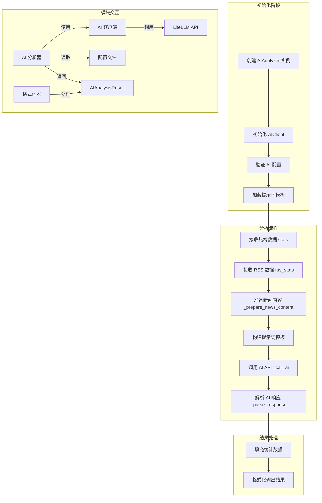

# AI 分析流程图及详细说明

## 1. AI 分析流程图

## 2. 核心模块说明

### 2.1 AIAnalyzer（AI 分析器）
- **功能**：核心分析引擎，协调整个 AI 分析流程
- **主要方法**：
  - `analyze()`: 执行完整分析流程
  - `_prepare_news_content()`: 准备新闻内容文本
  - `_call_ai()`: 调用 AI API
  - `_parse_response()`: 解析 AI 响应

### 2.2 AIClient（AI 客户端）
- **功能**：基于 LiteLLM 的统一 AI 模型接口
- **支持**：100+ AI 提供商（OpenAI、DeepSeek、Gemini、Claude 等）
- **主要方法**：`chat()`: 发送消息到 AI 模型

### 2.3 AIAnalysisResult（分析结果）
- **功能**：存储和传递分析结果
- **核心字段**：
  - `core_trends`: 核心热点与舆情态势
  - `sentiment_controversy`: 舆论风向与争议
  - `signals`: 异动与弱信号
  - `rss_insights`: RSS 深度洞察
  - `outlook_strategy`: 研判与策略建议

### 2.4 格式化器
- **功能**：将分析结果转换为不同格式
- **支持格式**：Markdown、HTML、纯文本、钉钉、飞书等

## 3. 详细流程说明

### 3.1 初始化阶段
1. **创建 AIAnalyzer 实例**
   - 接收 AI 模型配置（LiteLLM 格式）
   - 接收分析功能配置
   - 接收获取时间的函数
   - 设置调试模式

2. **初始化 AIClient**
   - 基于提供的 AI 配置创建客户端
   - 支持多模型提供商

3. **验证配置**
   - 检查 API Key 是否配置
   - 验证模型配置是否正确

4. **加载提示词模板**
   - 从配置文件加载系统提示词
   - 加载用户提示词模板

### 3.2 分析流程
1. **准备新闻内容** (`_prepare_news_content`)
   - 处理热榜数据：按关键词分组，包含来源、标题、排名范围、时间范围、出现次数
   - 处理 RSS 数据：包含来源、标题、发布时间
   - 限制分析新闻数量（默认 50 条）

2. **构建提示词**
   - 替换模板中的变量：
     - `{report_mode}`: 报告模式
     - `{report_type}`: 报告类型
     - `{current_time}`: 当前时间
     - `{news_count}`: 新闻数量
     - `{rss_count}`: RSS 数量
     - `{platforms}`: 平台列表
     - `{keywords}`: 关键词列表
     - `{news_content}`: 新闻内容
     - `{rss_content}`: RSS 内容
     - `{language}`: 语言设置

3. **调用 AI API** (`_call_ai`)
   - 构建消息列表（系统消息 + 用户消息）
   - 通过 AIClient 调用 LiteLLM API
   - 处理 API 响应

4. **解析 AI 响应** (`_parse_response`)
   - 提取 JSON 格式响应
   - 解析核心字段：核心热点、舆论风向、异动信号、RSS 洞察、策略建议
   - 处理解析错误，确保有输出

### 3.3 结果处理
1. **填充统计数据**
   - 总新闻数
   - 热榜新闻数
   - RSS 新闻数
   - 实际分析的新闻数
   - 分析上限配置值

2. **格式化输出**
   - 根据不同平台选择不同格式化器
   - 生成适合不同渠道的输出格式
   - 包含所有核心分析结果板块

## 4. 数据流说明

### 4.1 输入数据
- **热榜数据** (`stats`): 包含关键词、标题、来源、排名、时间等信息的列表
- **RSS 数据** (`rss_stats`): 包含关键词、标题、来源、发布时间等信息的列表
- **配置参数**:
  - `report_mode`: 报告模式（daily/current/incremental）
  - `report_type`: 报告类型
  - `platforms`: 平台列表
  - `keywords`: 关键词列表

### 4.2 输出数据
- **AIAnalysisResult** 对象：
  - 核心分析结果（5 个板块）
  - 统计数据
  - 原始响应
  - 错误信息
- **格式化输出**：
  - Markdown 格式（通用、钉钉、飞书）
  - HTML 格式（邮件、报告）
  - 纯文本格式

## 5. 配置说明

### 5.1 AI 模型配置
- **MODEL**: 模型标识（格式: provider/model_name）
- **API_KEY**: API 密钥
- **API_BASE**: API 基础 URL（可选）
- **TEMPERATURE**: 采样温度
- **MAX_TOKENS**: 最大生成 token 数
- **TIMEOUT**: 请求超时时间（秒）
- **NUM_RETRIES**: 重试次数
- **FALLBACK_MODELS**: 备用模型列表

### 5.2 分析功能配置
- **MAX_NEWS_FOR_ANALYSIS**: 分析的最大新闻数（默认 50）
- **INCLUDE_RSS**: 是否包含 RSS 数据（默认 True）
- **INCLUDE_RANK_TIMELINE**: 是否包含排名时间线（默认 False）
- **LANGUAGE**: 分析语言（默认 Chinese）
- **PROMPT_FILE**: 提示词文件（默认 ai_analysis_prompt.txt）

## 6. 错误处理

### 6.1 配置错误
- API Key 未配置
- 模型配置无效
- 提示词文件不存在

### 6.2 数据错误
- 没有可分析的新闻内容
- 新闻数据格式错误

### 6.3 API 错误
- API 调用失败
- 响应超时
- 模型返回错误

### 6.4 解析错误
- JSON 解析错误
- 响应格式不符合预期

## 7. 性能优化

### 7.1 数据处理优化
- 限制分析的新闻数量（默认 50 条）
- 优先处理热榜数据，再处理 RSS 数据
- 只处理有效的新闻标题和数据

### 7.2 API 调用优化
- 合理设置超时时间（默认 120 秒）
- 配置重试机制（默认 2 次）
- 使用备用模型确保分析可靠性

### 7.3 内存优化
- 流式处理新闻数据
- 避免重复计算和存储
- 及时释放不需要的资源

## 8. 调试模式

### 8.1 调试信息输出
- 打印 AI 模型配置
- 打印 API Key（部分掩码）
- 打印完整的提示词模板
- 打印 API 调用参数

### 8.2 错误信息增强
- 详细的错误上下文
- 具体的错误位置和原因
- 友好的错误提示

## 9. 总结

AI 分析模块是 TrendRadar 的核心功能之一，通过调用大语言模型对热点新闻进行深度分析，提供有价值的洞察和建议。整个流程设计清晰，模块分工明确，配置灵活，支持多种 AI 模型和输出格式，能够满足不同场景的需求。

主要优势：
- 基于 LiteLLM 统一接口，支持 100+ AI 模型
- 灵活的配置系统，适应不同需求
- 完善的错误处理机制，确保系统稳定
- 多种输出格式，支持不同推送渠道
- 详细的调试信息，方便问题排查
- 性能优化，确保分析效率

通过这套 AI 分析系统，TrendRadar 能够为用户提供更加智能、深入的热点分析服务，帮助用户更好地理解和把握热点趋势。